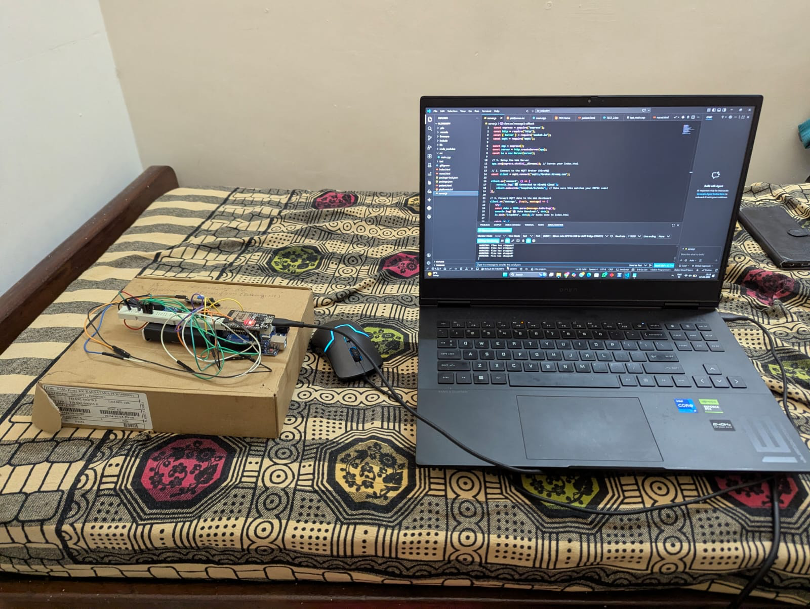

# Smart Automated IV Therapy Monitoring System

**Invention Disclosure Document Ref**: `IDF-B/2025/001`  
An embedded healthcare automation and patient safety system designed to eliminate dry-drip and air embolism risks during intravenous infusion therapy.



---

## 📌 Problem & Motivation

In busy clinical settings, IV drip bottles frequently run dry unnoticed by nursing staff. Once depleted:
- Patient blood can back-flow into the catheter line due to venous blood pressure.
- Risk of fatal **air embolism** increases significantly if air enters the circulatory system.
- Over-infusion or erratic drip rates can cause circulatory overload or ineffective medication dosing.

Existing commercial smart infusion pumps are prohibitively expensive for rural hospitals and standard hospital wards. The **Smart IV Monitoring System** introduces a cost-effective, non-invasive automated monitoring device utilizing standard embedded components.

---

## 💡 System Innovations & Features

1. **Non-Invasive Ultrasonic Fluid Level Sensing**:
   - An **HC-SR04 ultrasonic sensor** mounted atop the IV bottle measures the air-fluid boundary distance in real time.
   - Threshold detection at **15 cm** detects critical bottle depletion before empty line conditions occur.
2. **Optical Drop Counting Subsystem**:
   - High-sensitivity **LDR & LED optical pair** positioned across the drip chamber counts individual falling drops to monitor infusion flow rate continuously.
3. **Audible & Visual Alert Actuation**:
   - An active **5V piezo buzzer** produces an immediate acoustic alarm upon detecting critical fluid depletion.
   - High-contrast **16x2 LCD display** delivers continuous local feedback on fluid height (`cm`) and cumulative drop count.
4. **Self-Resetting Loop**:
   - Automatically silences the buzzer and resumes normal monitoring immediately upon replacement of the IV container.

---

## ⚙️ Hardware Architecture & Pinout

| Component | Pin / Channel | Description |
|---|---|---|
| **Arduino Uno (ATmega328P)** | MCU | Central controller running real-time sensing loop |
| **HC-SR04 Trigger** | Digital Pin `9` | 10 µs pulse initiation |
| **HC-SR04 Echo** | Digital Pin `10` | Pulse flight time measurement |
| **LDR Drop Detector** | Analog Pin `A0` | Light occlusion comparator |
| **5V Active Buzzer** | Digital Pin `8` | Audible alarm output |
| **16x2 Character LCD** | Pins `12, 11, 5, 4, 3, 2` | Parallel 4-bit LCD driver interface |

---

## 📄 Invention Disclosure Specification

The full Invention Disclosure Format (IDF-B) patent draft document is stored under [`docs/`](docs/):
- [SmartIV_Invention_Disclosure_IDF_B.docx](docs/SmartIV_Invention_Disclosure_IDF_B.docx) — Complete 10-section formal disclosure report including prior art analysis, architectural block diagrams, experimental validation, and Technology Readiness Level (TRL).

---

## 🚀 Installation & Firmware Flashing

1. Clone this repository:
   ```bash
   git clone https://github.com/AzaanGIT/smart-iv-therapy-monitoring.git
   ```
2. Open `src/SmartIV_Firmware.ino` in Arduino IDE.
3. Connect your Arduino Uno over USB.
4. Verify and upload the firmware.
